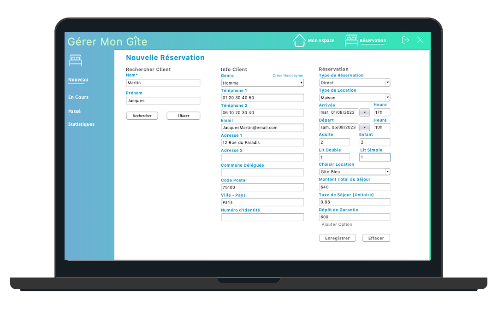

<h2 align="center">
  Portfolio Website 
  <a href="https://www.gerer-mon-gite.com/" target="_blank">Gérer Mon Gîtes</a>
</h2>

  

 

<h3 align="center">
    🔹
    <a href="https://github.com/Daviddaill/Booking-Management-System/issues">Report Bug</a> &nbsp; &nbsp;
    🔹
    <a href="https://github.com/Daviddaill/Booking-Management-System/issues">Request Feature</a>
</h3>

## Built With

A Java Desktop Application, <a href="https://www.gerer-mon-gite.com/" target="_blank">Gérer mon gîte</a>  

This project was built using these technologies.

- Java
- Netbeans
- SQL h2
- MySQL

## Features

**📧 Ready to Send Email**

**📄 Automatic Contract **

**🔒 OAUTH2 Authentification**

**📖 address book**

**📈 statistics**

